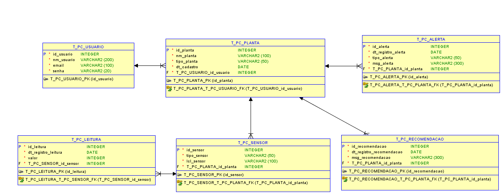
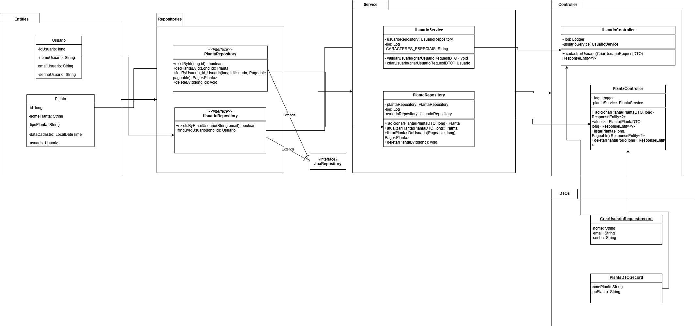

# 🌱 PlantCare API: Sistema de Monitoramento e Recomendação para Cultivo

## 💡 Proposta Tecnológica (Visão Geral do MVP - Sprint 1)

A PlantCare API é o módulo de backend desenvolvido em Java com Spring Boot e JPA para o Challenge Oracle (2TDS). O objetivo é fornecer uma base de dados sólida para um sistema de gestão de plantas.

O problema central que buscamos solucionar é a gestão descentralizada de dados de cultivo. Nossa API centraliza o gerenciamento de Usuários e o cadastro de suas Plantas, sendo a fundação para futuras integrações com sensores, alertas e recomendações.

### Público-Alvo

- **Clientes (Pagantes)**: Pequenos e médios produtores rurais ou empresas de agricultura de precisão que necessitam de um sistema de gestão de dados centralizado e robusto.

- **Consumidores (Usuários Finais)**: Técnicos agrícolas, agrônomos e cultivadores domésticos que utilizarão a aplicação mobile para monitorar suas plantas.

## 🎥 Link para o Vídeo da Proposta Tecnológica

[Link do YouTube](https://www.youtube.com/watch?v=AWLglePin50&feature=youtu.be "Proposta Tecnológica")

## 👥 Integrantes e Responsabilidades

Este projeto foi desenvolvido por:

| Nome Completo | RM |
|---------------|-----|
| João Victor Alves da Silva | 559726 |
| Vinicius Kenzo Tocuyosi | 559982 |

## 🛠️ Instruções de Execução da Aplicação (API Java/Spring Boot)

### Pré-requisitos

- Java JDK 25
- Maven
- Banco de Dados Oracle (Autonomous Database ou instalação local)

### Configuração do Banco de Dados

⚠️ **ARQUIVO DE CONFIGURAÇÃO (application.properties)**

O arquivo de configuração com as credenciais do banco de dados (`src/main/resources/application.properties`) está incluso no arquivo `.gitignore` por questões de segurança.

O professor responsável pela avaliação receberá o arquivo de propriedades com as credenciais de acesso ao Oracle Database separadamente para que possa executar a aplicação e validar a persistência dos dados.

Para rodar o projeto em outro ambiente, crie o arquivo e preencha com as suas próprias credenciais, garantindo que o context-path esteja configurado para `/api`:

```properties
# Exemplo de configuração COMPLETA no application.properties
spring.application.name=plantcare-api
server.servlet.context-path=/api

spring.datasource.url = jdbc:oracle:thin:@SEU_HOST_ORACLE:1521:SEU_SERVICO
spring.datasource.username = SEU_USUARIO
spring.datasource.password = SUA_SENHA
spring.jpa.hibernate.ddl-auto=update
spring.datasource.driver-class-name=oracle.jdbc.driver.OracleDriver

#otimizar as queries SQL Oracle
spring.jpa.database-platform=org.hibernate.dialect.OracleDialect
spring.jpa.show-sql=true
```

### Inicialização do Servidor

1. Clone o repositório e navegue até a pasta raiz do projeto.

2. Compile o projeto usando o wrapper Maven fornecido:

```bash
./mvnw clean install
```

3. Execute a aplicação via Spring Boot:

```bash
./mvnw spring-boot:run
```

A API estará acessível no contexto base `/api` em `http://localhost:8080/api`.

## 🗃️ Documentação e Testes (Pasta docs/)

Para facilitar a correção, toda a documentação e os arquivos de teste foram organizados na pasta `docs/` na raiz do projeto:

| Arquivo/Item | Conteúdo |
|--------------|----------|
| Documentação Java Sprint01.pdf | Documentação Completa do projeto, incluindo o Cronograma, o Diagrama MER, e o Diagrama UML (Diagrama de Classes de Entidade). |
| PlantCare.postman_collection.json | Collection do Postman com todas as requisições de teste prontas para os endpoints implementados. |

## 🖼️ Imagens dos Diagramas

Os diagramas concebidos para a modelagem do projeto estão a seguir (e em melhor qualidade na documentação PDF).

### Diagrama Entidade-Relacionamento (DER - Modelo Lógico/Físico)

Este é o Diagrama Amarelo que representa a estrutura relacional das tabelas.




### Diagrama de Classes de Entidade (Modelo UML - Camada de Domínio)

Este diagrama (presente na documentação como "Diagrama UML") representa o Mapeamento Objeto-Relacional (ORM) das classes Java.




## 🌐 Endpoints da API Implementados (Nível de Maturidade 1 - Richardson)

A API segue o Modelo de Maturidade Nível 1, utilizando o HTTP para diferentes ações (POST, PUT, GET, DELETE).

### Recurso: /usuario

| Método HTTP | Rota Completa | Descrição |
|-------------|---------------|-----------|
| POST | `/api/usuario/criarUsuario` | Cria um novo usuário. |

### Recurso: /planta

| Método HTTP | Rota Completa | Descrição |
|-------------|---------------|-----------|
| POST | `/api/planta/{id_usuario}/adicionarPlanta` | Cadastra uma nova planta associada a um usuário. |
| PUT | `/api/planta/atualizarPlanta/{id_planta}` | Atualiza nome e tipo de uma planta existente. |
| GET | `/api/planta/listarPlantas/{id_usuario}` | Lista plantas de um usuário com paginação (`?page=0&size=10`).|
| DELETE | `/api/planta/deletarPlanta/{id_planta}` | Remove uma planta pelo seu ID.  |